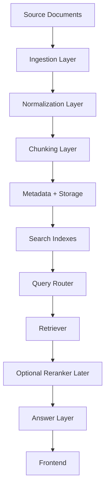

# 01 — Big Picture

## Goal

We want to build a personal knowledge library that can search across different kinds of material:

- recipes
- science notes/books/papers
- engineering documents
- programming notes and references
- transcripts from videos
- images containing text
- markdown and raw text files
- PDFs, including scanned PDFs

The system should let the user search globally or focus on one category, such as:

- `recipes`
- `science`
- `engineering`
- `programming/ios`
- `programming/flutter`
- `programming/ai-engineering`

## First Important Design Decision

We should not start by building a completely separate RAG system for each category.

Instead, we start with one shared platform:

```text
Documents
   ↓
Ingestion
   ↓
Normalization
   ↓
Chunking
   ↓
Metadata tagging
   ↓
Indexes
   ↓
Query routing
   ↓
Retrieval
   ↓
Answer generation / source display
   ↓
Frontend
```

The categories still matter, but they are represented mostly through metadata and filters.

For example, a chunk of text might have metadata like:

```json
{
  "category": "programming",
  "subcategory": "ios",
  "source_type": "markdown",
  "title": "SwiftUI Navigation Notes",
  "document_id": "doc_123"
}
```

This lets the frontend say:

> Search only inside `programming/ios`.

without needing a totally separate RAG application for iOS.

## Why This Matters

A personal knowledge library will eventually have many types of content. If we build a separate system for every category, we duplicate a lot of work:

- one ingestion pipeline for recipes
- another for science
- another for programming
- another for transcripts
- another for images

That becomes hard to maintain.

A better starting architecture is:

- one ingestion system
- one normalized internal document format
- one retrieval layer
- many category filters
- optional category-specific behavior where needed

## Mental Model

Think of the system as a library.

A real library does not build a separate building for every subject. Instead, it has:

- books
- shelves
- categories
- labels
- an index/catalog
- search tools

Our RAG system should work similarly.

The documents are the books.
The metadata is the catalog.
The indexes are the search tools.
The LLM is the assistant that helps explain and summarize the search results.

## High-Level Architecture



## Important Terms

### Ingestion

Getting source material into the system.

Examples:

- reading a PDF
- loading markdown files
- importing transcripts
- extracting text from images

### Normalization

Converting different input types into a common internal shape.

A PDF, markdown note, transcript, and image are different files, but after normalization they should all become records the system can understand.

### Chunking

Splitting large content into smaller searchable pieces.

This step is extremely important because retrieval quality depends heavily on chunk quality.

### Metadata

Extra information attached to each document or chunk.

Examples:

- category
- subcategory
- source file
- source locator, such as PDF page number or video timestamp
- author
- document type

### Retrieval

Finding the most relevant chunks for a user question.

### RAG

Retrieval-Augmented Generation.

The system retrieves relevant source material first, then gives that material to an LLM so the LLM can answer with grounding.

## Initial Architecture Choice

For the first version, we should build:

```text
One shared RAG platform
+ category-aware metadata
+ category filters
+ source-specific ingestion
+ hybrid retrieval later
```

We should avoid starting with:

```text
One totally separate RAG app per category
```

because that makes the system harder to learn, test, and evolve.

## Starting Decisions

We resolved the first set of architecture questions like this:

1. Categories should be stored as metadata. Folders are allowed for human organization, but the system should not depend on them.
2. The first version should support PDFs first.
3. The first domain should be recipes.
4. The system should be local-first while we learn, but designed so it can later be hosted and accessed from multiple frontends.
5. The backend should expose an API so web, iOS, and other clients can use the same core system.

## Next Step

The next document defines the first data model:

> What is a `SourceAsset`?
> What is a `Document`?
> What is a `SourceSpan`?
> What is a `KnowledgeItem`?
> What is a `Chunk`?
> What is a `ChunkEmbedding`?
> What metadata do we need from the beginning?
