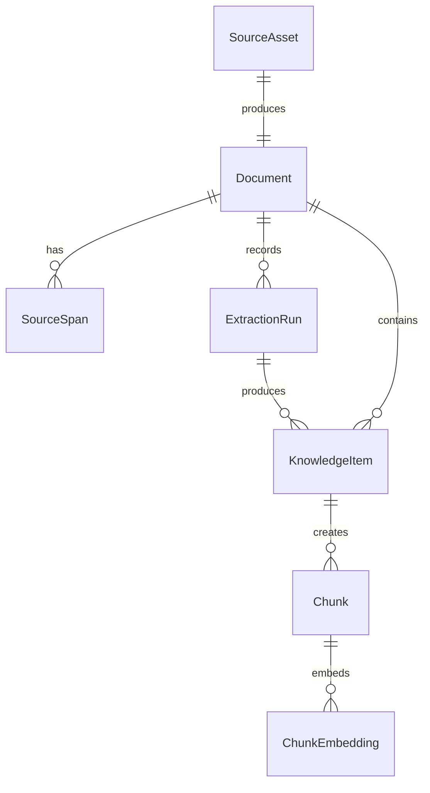

# 02 — Core Data Model

## Refinement

A `Recipe` is too specific to be a core platform object.

Recipes are our first domain, but later the library should also support science, engineering, programming, videos, transcripts, images, and more.

So the core model is:

```text
SourceAsset → Document → SourceSpan → KnowledgeItem → Chunk → ChunkEmbedding
```

A recipe is represented as:

```text
KnowledgeItem with item_type = "recipe"
```

This gives us a generic platform while still allowing recipe-specific structure where it creates value.

---

## Why Not Use Chunks Only?

A simple RAG demo can do this:

```text
PDF → text → chunks → embeddings → search
```

But chunks are a weak source of truth.

If we only store chunks, it becomes harder to support:

- type-specific UI/result cards
- ingredient filters
- pantry search
- shopping lists later
- deduplication
- confidence per recipe, ingredient, and step
- re-chunking later
- source navigation back to the original location

So the rule is:

> `KnowledgeItem` is the meaningful object. `Chunk` is the derived search unit.

---

## Core Objects

The core objects are:

```text
SourceAsset
Document
SourceSpan
KnowledgeItem
Chunk
ChunkEmbedding
ExtractionRun
```

---

## 1. SourceAsset

A `SourceAsset` is the original uploaded/imported file.

For the MVP, this means a PDF file.

Example:

```json
{
  "id": "asset_123",
  "source_type": "pdf",
  "original_filename": "the-food-lab.pdf",
  "storage_provider": "local",
  "storage_key": "source-assets/asset_123/original.pdf",
  "content_hash": "...",
  "upload_status": "uploaded",
  "created_at": "2026-05-21T00:00:00Z",
  "updated_at": "2026-05-21T00:00:00Z"
}
```

### `upload_status`

`SourceAsset.upload_status` tracks file upload/storage only.

Initial enum:

```text
uploading
uploaded
upload_failed
deleted
```

It should not be used for ingestion progress. Ingestion progress belongs to `Document.status`.

### Storage fields

We use:

```text
storage_provider
storage_key
```

instead of relying on provider-specific URI strings.

Examples:

```json
{ "storage_provider": "local", "storage_key": "source-assets/asset_123/original.pdf" }
```

```json
{ "storage_provider": "s3", "storage_key": "source-assets/asset_123/original.pdf" }
```

The file storage interface knows how to interpret the provider/key pair.

---

## 2. Document

A `Document` is the knowledge-layer representation of a source asset.

For the first recipe version:

```text
one PDF = one Document
```

Example:

```json
{
  "id": "doc_123",
  "asset_id": "asset_123",
  "category": "recipes",
  "subcategory": null,
  "title": "The Food Lab",
  "author": "J. Kenji López-Alt",
  "source_type": "pdf",
  "language": "en",
  "active_source_version": 1,
  "status": "ready",
  "created_at": "2026-05-21T00:00:00Z",
  "updated_at": "2026-05-21T00:00:00Z"
}
```

### Intentional denormalization

`documents.source_type` duplicates `source_assets.source_type` intentionally.

It makes category/source filtering and routing easier without always joining back to `source_assets`. It must match the parent asset's source type.

### Nullability

- `subcategory` is nullable. `null` means the document belongs directly to the top-level category, with no narrower subcategory assigned. It is not inferred from folders.
- `language` is nullable until detected or set by the user. When known, store a standard language code such as `en`.
- `active_source_version` is nullable until the first extraction is accepted. A `ready` document should have an active source version.

### `status`

`Document.status` tracks ingestion progress.

Initial enum:

```text
queued
extracting_text
creating_source_spans
extracting_items
validating_items
creating_chunks
embedding_chunks
indexing
ready
needs_review
failed
```

This is the status the frontend should poll after upload.

Use `ready` when ingestion completed and user-facing chunks are indexed. Use `needs_review` when ingestion completed but the document is not reliably searchable without review, for example if no ready knowledge items were produced.

Failure and retry transitions:

```text
any non-terminal ingestion status → failed
failed → queued        # retry
needs_review → queued  # retry after review or prompt/model change
ready → queued         # manual reprocess/re-extract
```

Terminal statuses are `ready`, `needs_review`, and `failed` until a manual retry/reprocess action moves the document back to `queued`.

When reprocessing a `ready` document, keep `active_source_version` pointing at the previous accepted version until the new extraction is accepted.

---

## 3. SourceSpan

A `SourceSpan` is an immutable snapshot of extracted text plus a source locator.

This replaces universal fields like `page_start` and `page_end`.

Pages make sense for PDFs, but later sources need different locators:

- PDFs use page ranges
- videos use timestamps
- transcripts may use timestamps and line numbers
- images use bounding boxes
- markdown/text files may use headings or line ranges

### PDF convention

For PDFs, the base convention is:

> Create one `SourceSpan` per PDF page.

A recipe or chunk that spans multiple pages references multiple source spans.

Example:

```json
{
  "id": "span_123",
  "document_id": "doc_123",
  "source_version": 1,
  "source_type": "pdf",
  "locator": {
    "type": "pdf_page_range",
    "page_start": 214,
    "page_end": 214
  },
  "locator_hash": "...",
  "text": "Tomato and White Bean Soup\nServes 4\nIngredients...",
  "text_hash": "...",
  "created_at": "2026-05-21T00:00:00Z"
}
```

### Source span stability

`SourceSpan` rows are immutable once created.

`source_version` is the version of the extracted source-text snapshot. It is not the same thing as an ingestion attempt.

Retry rule:

- If source spans were fully created and the retry is for a downstream failure, reuse the same `source_version`.
- If the retry changes text extraction behavior, OCR, parsing, or page text, create a new `source_version`.
- If failure happened before or during incomplete source span creation, ignore the partial spans and create a new `source_version` on retry.

Once any spans are created for a version, do not reuse that version number for different text. Source version numbers should be monotonically increasing per document.

If we re-extract a PDF using a better parser or OCR later, we create a new `source_version` with new spans instead of editing old spans in place.

`Document.active_source_version` should change only after the new version is accepted.

This prevents old `KnowledgeItem.source_span_ids` references from breaking.

### Source span retention

Keep source spans for old versions by default.

Do not delete a source span while any `ExtractionRun`, `KnowledgeItem`, or `Chunk` references it. A later cleanup/archive policy can remove old versions only after their dependent records are removed or archived.

### Hash fields

- `locator_hash` is a stable hash of the normalized `locator` JSON. It supports uniqueness checks like one span per page per source version.
- `text_hash` is a hash of extracted text. It helps detect duplicate/changed extraction output and supports caching/debugging.

### Intentional denormalization

`source_spans.source_type` duplicates `documents.source_type` intentionally.

It makes locator validation and debugging easier. The value must match the parent document's source type.

---

## 4. KnowledgeItem

A `KnowledgeItem` is a meaningful extracted object.

Examples:

- `recipe`
- `video_segment`
- `paper_section`
- `code_example`
- `concept_note`
- `image_ocr_block`

For the MVP, the first important type is:

```text
recipe
```

Example:

```json
{
  "id": "item_123",
  "document_id": "doc_123",
  "extraction_run_id": "run_123",
  "source_version": 1,
  "item_type": "recipe",
  "title": "Tomato and White Bean Soup",
  "normalized_title": "tomato and white bean soup",
  "summary": "A simple soup with pantry ingredients.",
  "body_text": "Tomato and White Bean Soup\nServes 4\nIngredients...\nSteps...",
  "source_span_ids": ["span_214", "span_215"],
  "structured_data": {
    "schema": "recipe.v1",
    "yield": "Serves 4",
    "prep_time": null,
    "cook_time": "35 minutes",
    "total_time": null,
    "ingredients_text": "2 tbsp olive oil\n1 onion, diced...",
    "ingredients": [
      {
        "position": 1,
        "raw_text": "2 tbsp olive oil",
        "quantity_text": "2",
        "quantity_value": 2,
        "unit_raw": "tbsp",
        "unit_normalized": "tablespoon",
        "item_text": "olive oil",
        "item_normalized": "olive oil",
        "preparation": null,
        "notes": null,
        "confidence": {
          "overall": 0.95,
          "quantity": 0.98,
          "unit": 0.96,
          "item": 0.97,
          "normalization": 0.9
        }
      }
    ],
    "steps_text": "Heat the oil in a large pot...",
    "steps": [
      {
        "step_number": 1,
        "text": "Heat the oil in a large pot.",
        "source_span_ids": ["span_215"],
        "confidence": {
          "overall": 0.92,
          "ordering": 0.9
        }
      }
    ]
  },
  "confidence": {
    "overall": 0.88,
    "boundary": 0.82,
    "fields": {
      "title": 0.96,
      "summary": 0.84,
      "yield": 0.9,
      "ingredients": 0.91,
      "steps": 0.87
    }
  },
  "status": "ready",
  "created_at": "2026-05-21T00:00:00Z",
  "updated_at": "2026-05-21T00:00:00Z"
}
```

### `normalized_title`

`normalized_title` is a deterministic backend-generated normalization of `title`, used for deduplication and soft uniqueness checks.

For example:

```text
"Tomato and White Bean Soup" → "tomato and white bean soup"
```

The LLM may return only `title`; the backend can compute `normalized_title` before storing the item.

### Item status

Initial enum:

```text
ready
needs_review
superseded
```

`needs_review` items are stored for review/debugging, but are not chunked, embedded, or included in user-facing search by default.

`superseded` items are older extracted items that have been replaced by a newer accepted source version or re-extraction pass.

There is no `rejected` item status in the MVP. Hard validation failures do not create `KnowledgeItem` rows; they are recorded through `ExtractionRun.status = "rejected"`.

### Superseding rule

For the MVP, superseding is document-level, not item-match based.

When a new extraction is accepted for a document, the backend marks older non-superseded `KnowledgeItem` rows for that document as `superseded`. This includes older `ready` and older `needs_review` items.

For automatic promotion, "accepted" means the new extraction reached `Document.status = "ready"`. If a re-extraction ends in `needs_review` or `failed`, it should not automatically supersede the previous ready version. A future review UI may allow manual acceptance.

Old chunks/embeddings for superseded items should be filtered out of user-facing search, not deleted by default. Later, we can add cleanup jobs and item-level matching using `normalized_title`, source spans, and ingredient similarity.

### `structured_data`

`structured_data` lets us support domain-specific fields without making the core platform recipe-specific.

A future `video_segment.v1` should not duplicate source locator fields. The timestamp range belongs in `SourceSpan.locator`.

Example future video structured data:

```json
{
  "schema": "video_segment.v1",
  "speaker": "...",
  "topics": ["vector search", "embeddings"]
}
```

### `item_text` vs `item_normalized`

For recipe ingredients:

- `raw_text` is the full original ingredient line.
- `item_text` is the ingredient item phrase extracted from that line.
- `item_normalized` is the canonical/search form.

Example:

```json
{
  "raw_text": "1 medium onion, diced",
  "item_text": "medium onion",
  "item_normalized": "onion",
  "preparation": "diced"
}
```

The normalized value is for search and filtering. The raw/text values are for display and auditability.

---

## 5. Chunk

A `Chunk` is a derived text unit optimized for retrieval.

Chunks are not the source of truth. They can be regenerated from `KnowledgeItem` records.

Example:

```json
{
  "id": "chunk_123",
  "document_id": "doc_123",
  "parent_type": "knowledge_item",
  "parent_id": "item_123",
  "chunk_type": "recipe_ingredients",
  "text": "2 tbsp olive oil\n1 onion, diced\n2 cans white beans...",
  "text_hash": "...",
  "source_span_ids": ["span_214", "span_215"],
  "metadata": {
    "category": "recipes",
    "item_type": "recipe",
    "title": "Tomato and White Bean Soup"
  },
  "created_at": "2026-05-21T00:00:00Z",
  "updated_at": "2026-05-21T00:00:00Z"
}
```

### `parent_type`

Initial enum:

```text
knowledge_item
```

Future possible values may include `document` or `source_span`, but the MVP only creates chunks from ready `KnowledgeItem` records.

### `text_hash`

`chunks.text_hash` is a hash of the chunk text. It helps detect whether a chunk changed and whether embeddings need to be regenerated.

### Canonical recipe chunk types

Use this same set everywhere:

```text
recipe_full
recipe_title
recipe_summary
recipe_ingredients
recipe_steps
```

### Intentional denormalization

`chunks.document_id` is redundant because `parent_id → knowledge_items.document_id` already exists.

We keep it intentionally for faster category/document filtering during retrieval. It must match the parent item's document.

### Superseded parent policy

Chunks and embeddings whose parent `KnowledgeItem` is `superseded` are excluded from user-facing retrieval by filter.

They are not deleted by default, because they are useful for audit/debugging and can be cleaned up later if storage becomes a concern.

---

## 6. ChunkEmbedding

A `ChunkEmbedding` stores the vector representation of a chunk.

Example:

```json
{
  "id": "embedding_123",
  "chunk_id": "chunk_123",
  "embedding_provider": "openai",
  "embedding_model": "text-embedding-example",
  "embedding_dimensions": 1536,
  "embedding_vector": "[omitted for brevity]",
  "created_at": "2026-05-21T00:00:00Z"
}
```

The actual vector is stored in the database vector column. It is omitted from examples because it is large.

### Re-embedding rule

A chunk may have multiple embeddings, but only one per provider/model pair.

Unique key:

```text
(chunk_id, embedding_provider, embedding_model)
```

If we use a new embedding model, we append new rows.

If we regenerate the same provider/model for the same chunk, we replace that row.

---

## 7. ExtractionRun

An `ExtractionRun` records an attempt to extract structured data from source spans.

It includes `source_version` so we know which immutable source-text snapshot the model saw.

Example:

```json
{
  "id": "run_123",
  "document_id": "doc_123",
  "source_version": 1,
  "provider": "openai",
  "model": "example-model-name",
  "prompt_version": "recipe-extraction-v1",
  "schema_version": "recipe.v1",
  "input_source_span_ids": ["span_214", "span_215"],
  "input_hash": "...",
  "status": "success",
  "output_json": { "items": [] },
  "error_message": null,
  "created_at": "2026-05-21T00:00:00Z",
  "completed_at": "2026-05-21T00:00:12Z"
}
```

Initial status enum:

```text
running
success
failed
rejected
```

Status meanings:

- `running`: the LLM call or extraction step is in progress.
- `success`: the model returned output and hard validation passed. The output may still produce `needs_review` items due to soft validation.
- `failed`: a technical/provider/system failure occurred, such as timeout, rate limit, or API error.
- `rejected`: the model returned output, but hard validation rejected it.

Extraction runs are audit records. Once completed, they should not be edited except for exceptional administrative repair.

---

## Relationships



Notes:

- `KnowledgeItem.source_span_ids` points to immutable `SourceSpan` rows.
- `Chunk.source_span_ids` points to the spans used by that retrieval unit.
- If a knowledge item is merged from multiple extraction outputs later, we can add richer provenance. For MVP, `extraction_run_id` points to the accepted run that produced the current item.
- `KnowledgeItem.source_version` is copied from the accepted `ExtractionRun.source_version`.
- Every `source_span_id` referenced by a `KnowledgeItem` should belong to the same document and source version as the item.

---

## Confidence Scores

Confidence exists at multiple levels.

### Knowledge item confidence

```json
{
  "overall": 0.88,
  "boundary": 0.82
}
```

### Field confidence

```json
{
  "fields": {
    "title": 0.96,
    "ingredients": 0.91,
    "steps": 0.87
  }
}
```

### Ingredient confidence

Use this canonical five-field shape:

```json
{
  "overall": 0.95,
  "quantity": 0.98,
  "unit": 0.96,
  "item": 0.97,
  "normalization": 0.9
}
```

### Step confidence

```json
{
  "overall": 0.92,
  "ordering": 0.9
}
```

Important:

> LLM confidence is not perfect truth. It is a review signal.

Later we can combine LLM confidence with deterministic validation checks to produce a stronger system confidence score.

---

## Timestamps and Mutability

Current-state tables are mutable and should have `created_at` and `updated_at`:

```text
source_assets
documents
knowledge_items
chunks
```

Immutable or append-only tables use `created_at`, and sometimes `completed_at`:

```text
source_spans       immutable snapshot
extraction_runs    append-only audit record
chunk_embeddings   derived row, replaceable per provider/model
```

---

## Current Decisions

For the first implementation:

1. Metadata is the source of truth; folders are not required by the system.
2. Start with PDFs only.
3. Start with recipes first.
4. One PDF maps to one `Document`.
5. PDFs are mostly selectable text.
6. PDF `SourceSpan`s are one span per page.
7. `SourceSpan`s are immutable; re-extraction creates a new `source_version`.
8. Recipes are `KnowledgeItem` records with `item_type = "recipe"`.
9. Structured ingredients and steps are extracted immediately.
10. Ingredient normalization starts early, while preserving raw text.
11. The app is single-user first, but hostable.
12. Use PostgreSQL + pgvector as the first storage/search foundation.
13. Use a file storage interface with `storage_provider` + `storage_key`.
14. Confidence scores exist at item, field, ingredient, and step levels.

---

## Next Step

The next documents cover:

1. PDF ingestion for cookbook sources.
2. LLM-assisted extraction into `KnowledgeItem` records.
3. Storage and indexing for assets, documents, source spans, knowledge items, chunks, embeddings, and extraction runs.
