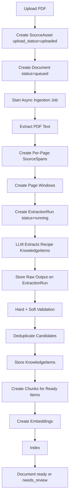

# 03 — PDF Ingestion Pipeline

## Starting Point

For the first implementation, we are focusing on:

- source type: **PDFs only**
- first domain: **recipes**
- PDF shape: **mostly selectable text**
- document mapping: **one PDF = one Document**
- extraction strategy: **LLM-assisted from the start**
- ingredient handling: **normalize early while preserving raw text**
- import flow: **one PDF at a time first**
- source review: **no page thumbnails/images for now**
- LLM integration: **provider interface, not hardcoded provider**
- storage/search: **PostgreSQL + pgvector**
- user model: **single personal user first**

---

## Status Ownership

Two different status fields are involved here:

- `SourceAsset.upload_status` tracks file upload/storage only.
- `Document.status` tracks ingestion progress.

The ingestion lifecycle belongs to `Document.status`, not `SourceAsset.upload_status`. The full enums, transitions (including `failed`, `needs_review`, retry/reprocess), and meaning of `ready` vs `needs_review` are defined in [02 — Core Data Model](./02-core-data-model.md#2-document) and apply unchanged here.

This document focuses on what each ingestion stage *does*, not on enumerating the statuses again.

---

## Sync vs Async Ingestion

PDF ingestion should be asynchronous from the API client's perspective.

The upload request should not wait for the full cookbook to be processed.

Instead:

```text
client uploads PDF
  ↓
backend stores file + creates SourceAsset + creates Document(status=queued)
  ↓
backend starts ingestion job
  ↓
client polls Document.status
```

For the first implementation, the ingestion job can be a simple single-process background task.

We do not need a production queue yet, but the architecture should make it easy to add one later.

### Stuck-job recovery

If the process crashes during ingestion, a document may be left in a non-terminal status.

Initial recovery rule:

- terminal statuses are `ready`, `needs_review`, and `failed`
- if a document stays in a non-terminal status past a configured timeout, mark it `failed`
- retrying sets `Document.status = "queued"` and starts a new ingestion attempt
- manual reprocessing from `ready` also sets `Document.status = "queued"`
- partial derived data from failed attempts should be ignored or cleaned up unless it belongs to ready knowledge items

Example mid-pipeline failure:

```text
embedding_chunks → failed
```

If embeddings fail after source spans and chunks were created, the MVP retry may reuse the same completed `source_version` and rerun downstream steps. If the retry changes PDF text extraction, it must create a new `source_version`.

---

## Pipeline Overview



---

## 1. Upload PDF

The backend stores the original file through the file storage interface and creates a `SourceAsset`.

Example:

```json
{
  "id": "asset_123",
  "source_type": "pdf",
  "original_filename": "simple-thai-food.pdf",
  "storage_provider": "local",
  "storage_key": "source-assets/asset_123/original.pdf",
  "content_hash": "...",
  "upload_status": "uploaded"
}
```

`content_hash` should be unique so we can detect duplicate uploads.

---

## 2. Create Document

For the first version, one PDF creates one `Document`.

Example:

```json
{
  "id": "doc_123",
  "asset_id": "asset_123",
  "category": "recipes",
  "subcategory": null,
  "title": "Simple Thai Food",
  "author": "Leela Punyaratabandhu",
  "source_type": "pdf",
  "active_source_version": null,
  "status": "queued"
}
```

Some metadata can be inferred from the PDF, but we should assume the user may need to edit it.

PDF metadata is often incomplete or wrong.

---

## 3. Extract PDF Text

Because the first PDFs are mostly selectable text, the first extractor can be text-based.

The output should preserve source location.

We do that by creating `SourceSpan` records.

---

## 4. Create Per-Page SourceSpans

For PDFs, the convention is:

> one `SourceSpan` per page

Example:

```json
{
  "id": "span_042",
  "document_id": "doc_123",
  "source_version": 1,
  "source_type": "pdf",
  "locator": {
    "type": "pdf_page_range",
    "page_start": 42,
    "page_end": 42
  },
  "locator_hash": "...",
  "text": "Tomato and White Bean Soup\nServes 4\nIngredients...",
  "text_hash": "..."
}
```

A recipe that spans multiple pages references multiple source span IDs.

`SourceSpan` immutability, the `source_version` retry rule, `locator_hash` / `text_hash` semantics, and retention are defined in [02 — Core Data Model](./02-core-data-model.md#3-sourcespan). The ingestion-side implication is that retries which change PDF text extraction must create a new `source_version`; retries that only rerun downstream steps reuse the existing one.

---

## 5. Create Page Windows

We should not send an entire cookbook to the LLM at once.

Instead, we group source spans into overlapping page windows.

Initial convention:

```text
window_size_pages = 3
overlap_pages = 1
```

Example:

```text
pages 1-3
pages 3-5
pages 5-7
pages 7-9
```

The overlap helps with recipes that span page boundaries.

Each input should include source span IDs:

```text
[SOURCE_SPAN span_042 | PDF page 42]
Tomato and White Bean Soup
Serves 4
Ingredients...

[SOURCE_SPAN span_043 | PDF page 43]
Heat the oil in a large pot...
```

---

## 6. LLM Extracts Recipe KnowledgeItems

The LLM call for each window should extract everything needed for recipe candidates in one pass:

- recipe boundaries
- title
- summary/headnote
- yield/time fields
- ingredients text
- structured ingredients
- normalized ingredient names/units
- steps
- source span references
- confidence scores

This reconciles the high-level ingestion pipeline with the LLM extraction design:

> The pipeline has multiple stages, but recipe boundary detection, field extraction, ingredient parsing, and normalization happen inside the LLM-assisted extraction step for each page window.

Example output shape:

```json
{
  "items": [
    {
      "item_type": "recipe",
      "title": "Tomato and White Bean Soup",
      "summary": "A simple soup with pantry ingredients.",
      "body_text": "Tomato and White Bean Soup\nServes 4\nIngredients...\nSteps...",
      "source_span_ids": ["span_042", "span_043"],
      "structured_data": {
        "schema": "recipe.v1",
        "yield": "Serves 4",
        "prep_time": null,
        "cook_time": "35 minutes",
        "total_time": null,
        "ingredients_text": "2 tbsp olive oil\n1 onion, diced...",
        "ingredients": [
          {
            "position": 1,
            "raw_text": "2 tbsp olive oil",
            "quantity_text": "2",
            "quantity_value": 2,
            "unit_raw": "tbsp",
            "unit_normalized": "tablespoon",
            "item_text": "olive oil",
            "item_normalized": "olive oil",
            "preparation": null,
            "notes": null,
            "confidence": {
              "overall": 0.95,
              "quantity": 0.98,
              "unit": 0.96,
              "item": 0.97,
              "normalization": 0.9
            }
          }
        ],
        "steps_text": "Heat the oil in a large pot...",
        "steps": [
          {
            "step_number": 1,
            "text": "Heat the oil in a large pot.",
            "source_span_ids": ["span_043"],
            "confidence": {
              "overall": 0.92,
              "ordering": 0.9
            }
          }
        ]
      },
      "confidence": {
        "overall": 0.88,
        "boundary": 0.82,
        "fields": {
          "title": 0.96,
          "summary": 0.84,
          "yield": 0.9,
          "ingredients": 0.91,
          "steps": 0.87
        }
      },
      "warnings": []
    }
  ]
}
```

The backend can add derived fields after validation. For example, `normalized_title` is computed from `title` and does not need to come from the LLM.

---

## 7. Store ExtractionRun

Each LLM call should create an `ExtractionRun` record.

The run stores:

- source version
- provider
- model
- prompt version
- schema version
- input source span IDs
- input hash
- status
- raw output JSON
- error message if failed

This makes extraction debuggable and repeatable.

`ExtractionRun.status` values and their meanings are defined in [02 — Core Data Model](./02-core-data-model.md#7-extractionrun). Accepted `KnowledgeItem.source_version` values are copied from the `ExtractionRun.source_version`.

---

## 8. Validate Extraction

The backend does not blindly trust LLM output. Hard validation rejects a candidate outright (the raw payload stays on the `ExtractionRun`, and the run is marked `rejected` if the whole run fails). Soft validation lets a `KnowledgeItem` be stored with `status = "needs_review"`. `needs_review` items are not chunked, embedded, or returned in user-facing search by default.

The full validation rule lists, failure categories, and indexing policy live in [04 — LLM-Assisted Recipe Extraction](./04-llm-assisted-recipe-extraction.md#hard-vs-soft-validation).

---

## 9. Deduplicate Candidates

Because page windows overlap, the same recipe can appear in multiple extraction outputs. The MVP picks the best candidate by a backend `candidate_score` and links the chosen one to its `extraction_run_id`. Superseding of older accepted items happens at document level when the new extraction reaches `Document.status = "ready"`.

The dedup signals, scoring inputs, and supersede rule are defined in [04 — LLM-Assisted Recipe Extraction](./04-llm-assisted-recipe-extraction.md#deduplication) and [02 — Core Data Model](./02-core-data-model.md#superseding-rule).

---

## 10. Create Chunks

Only `KnowledgeItem`s with `status = "ready"` produce chunks for user-facing retrieval. The canonical chunk-type enum lives in [02 — Core Data Model](./02-core-data-model.md#canonical-recipe-chunk-types); the query-style mapping (title lookup, ingredient queries, technique queries, semantic search) lives in [04 — LLM-Assisted Recipe Extraction](./04-llm-assisted-recipe-extraction.md#chunk-creation).

Example:

```json
{
  "chunk_type": "recipe_ingredients",
  "parent_type": "knowledge_item",
  "parent_id": "item_123",
  "text": "2 tbsp olive oil\n1 onion, diced\n2 cans white beans...",
  "source_span_ids": ["span_042", "span_043"]
}
```

---

## 11. Create Embeddings and Index

After chunks exist, the system creates embeddings and indexes the chunks.

First implementation:

```text
PostgreSQL full-text search → keyword retrieval
pgvector → semantic retrieval
```

Embeddings are derived and can be regenerated.

---

## What This Teaches

This step teaches that RAG quality depends heavily on preprocessing.

The LLM answer at query time is not magic.

The quality comes from:

- good extraction
- stable source spans
- good metadata
- meaningful knowledge items
- useful chunks
- confidence and validation
- good retrieval

---

## Next Step

The next document covers LLM-assisted recipe extraction in more detail.
