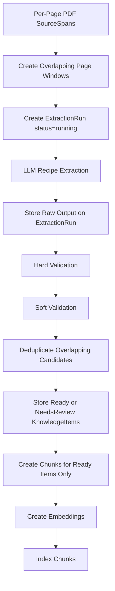

# 04 — LLM-Assisted Recipe Extraction

## Decision

Recipe extraction will be **LLM-assisted from the start**.

The LLM is used during ingestion to convert PDF `SourceSpan`s into structured `KnowledgeItem` candidates with:

- `item_type = "recipe"`
- recipe fields
- structured ingredients
- normalized ingredient names and units
- ordered steps
- confidence scores
- source span references

The LLM is not the whole RAG system. It is one component in the ingestion pipeline.

---

## Current Extraction Decisions

1. **No page images/thumbnails for now**
   - Store extracted text and source locators.
   - Add visual review later if needed.

2. **Import one PDF at a time first**
   - Easier to debug.
   - Batch import can come later.

3. **Normalize ingredients early**
   - Keep raw ingredient text.
   - Also extract normalized names and units where possible.

4. **Use an LLM provider interface**
   - The extractor should not be hardcoded to one provider.

5. **Use fixed window parameters first**
   - `window_size_pages = 3`
   - `overlap_pages = 1`

---

## Extraction Flow



---

## SourceSpan Input Convention

PDF source spans are one span per page.

The LLM receives a window of source spans like this:

```text
[SOURCE_SPAN span_042 | PDF page 42]
Tomato and White Bean Soup
Serves 4
Ingredients...

[SOURCE_SPAN span_043 | PDF page 43]
Heat the oil in a large pot...
```

The LLM must reference the source span IDs in its output.

Each `ExtractionRun` also records the `source_version` for those spans. Accepted `KnowledgeItem.source_version` values are copied from the accepted extraction run.

This keeps extraction grounded in source locations without putting PDF-specific `page_start` and `page_end` fields into the core item model.

---

## What the LLM Extracts

The LLM call for each page window should extract recipe candidates in one pass.

It handles:

- boundary detection
- field extraction
- ingredient parsing
- ingredient normalization
- step extraction
- confidence scoring

So the ingestion pipeline has many stages, but we do **not** have separate deterministic recipe-boundary and ingredient-parser stages in the first version.

---

## Strict Output Shape

The LLM should return strict JSON matching this conceptual shape:

```json
{
  "items": [
    {
      "item_type": "recipe",
      "title": "Tomato and White Bean Soup",
      "summary": "A simple soup with pantry ingredients.",
      "body_text": "Tomato and White Bean Soup\nServes 4\nIngredients...\nSteps...",
      "source_span_ids": ["span_042", "span_043"],
      "structured_data": {
        "schema": "recipe.v1",
        "yield": "Serves 4",
        "prep_time": null,
        "cook_time": "35 minutes",
        "total_time": null,
        "ingredients_text": "2 tbsp olive oil\n1 onion, diced...",
        "ingredients": [
          {
            "position": 1,
            "raw_text": "2 tbsp olive oil",
            "quantity_text": "2",
            "quantity_value": 2,
            "unit_raw": "tbsp",
            "unit_normalized": "tablespoon",
            "item_text": "olive oil",
            "item_normalized": "olive oil",
            "preparation": null,
            "notes": null,
            "confidence": {
              "overall": 0.95,
              "quantity": 0.98,
              "unit": 0.96,
              "item": 0.97,
              "normalization": 0.9
            }
          }
        ],
        "steps_text": "Heat the oil in a large pot...",
        "steps": [
          {
            "step_number": 1,
            "text": "Heat the oil in a large pot.",
            "source_span_ids": ["span_043"],
            "confidence": {
              "overall": 0.92,
              "ordering": 0.9
            }
          }
        ]
      },
      "confidence": {
        "overall": 0.88,
        "boundary": 0.82,
        "fields": {
          "title": 0.96,
          "summary": 0.84,
          "yield": 0.9,
          "ingredients": 0.91,
          "steps": 0.87
        }
      },
      "warnings": []
    }
  ]
}
```

The backend may add derived fields after validation. For example, `normalized_title` is computed from `title` for deduplication; the LLM does not need to provide it.

---

## Ingredient Field Meaning

For ingredients, these names have specific meanings:

| Field | Meaning |
| --- | --- |
| `raw_text` | Full original ingredient line. |
| `quantity_text` | Quantity as written, e.g. `1/2`, `2`, `a pinch`. |
| `quantity_value` | Numeric quantity when parseable. |
| `unit_raw` | Unit as written, e.g. `tbsp`. |
| `unit_normalized` | Canonical unit, e.g. `tablespoon`. |
| `item_text` | Ingredient phrase extracted from the line. |
| `item_normalized` | Canonical/search form of the ingredient. |
| `preparation` | Preparation phrase, e.g. `diced`, `drained`. |
| `notes` | Other notes, e.g. `to taste`. |

Example:

```json
{
  "raw_text": "1 medium onion, diced",
  "item_text": "medium onion",
  "item_normalized": "onion",
  "preparation": "diced"
}
```

---

## Confidence Scores

Confidence should use one canonical shape.

### Item confidence

```json
{
  "overall": 0.88,
  "boundary": 0.82,
  "fields": {
    "title": 0.96,
    "summary": 0.84,
    "yield": 0.9,
    "ingredients": 0.91,
    "steps": 0.87
  }
}
```

### Ingredient confidence

```json
{
  "overall": 0.95,
  "quantity": 0.98,
  "unit": 0.96,
  "item": 0.97,
  "normalization": 0.9
}
```

### Step confidence

```json
{
  "overall": 0.92,
  "ordering": 0.9
}
```

Important caveat:

> LLM confidence is not calibrated truth.

It is a review signal. Later, we can combine it with validation checks to calculate a stronger system confidence score.

---

## Hard vs Soft Validation

The backend must validate the model output.

### Hard validation failures

Hard failures reject the candidate.

Do not create a `KnowledgeItem` from that candidate. Keep the raw output only on the `ExtractionRun`.

If the whole run fails hard validation, mark the `ExtractionRun` as `rejected`. If the provider call or system execution fails, mark it as `failed`.

Examples:

- invalid JSON
- schema mismatch
- `item_type` is not `recipe`
- missing title
- missing `source_span_ids`
- source span IDs not present in the input window
- confidence value outside `0..1`
- ingredient object missing `raw_text`

### Soft validation failures

Soft failures may store a `KnowledgeItem` with:

```json
{ "status": "needs_review" }
```

Examples:

- no ingredients found
- no steps found
- low overall confidence
- low boundary confidence
- unusually short or long recipe
- normalization confidence is low

### Indexing rule

`needs_review` items are not chunked, embedded, or included in user-facing search by default.

A future review UI may show them separately.

---

## Deduplication

Because page windows overlap, the same recipe may be extracted twice.

Example:

```text
Window A: pages 42-44
Window B: pages 44-46
```

Possible deduplication signals:

- normalized title generated by the backend from the recipe title
- overlapping source spans
- same document
- similar ingredient list

For MVP:

> Compute a backend `candidate_score`, keep the highest-scoring candidate, and link the stored `KnowledgeItem` to the accepted `ExtractionRun`.

Initial `candidate_score` can combine:

- item `confidence.overall`
- boundary confidence
- presence of ingredients
- presence of steps
- source span coverage

Later we can add a richer provenance table if a final item is merged from multiple runs.

---

## Chunk Creation

Only ready recipe `KnowledgeItem`s create user-facing chunks. The canonical chunk-type enum is defined in [02 — Core Data Model](./02-core-data-model.md#canonical-recipe-chunk-types).

Each type targets a different retrieval pattern:

- `recipe_title` for exact recipe/title lookup
- `recipe_ingredients` for pantry or ingredient queries
- `recipe_steps` for cooking technique queries
- `recipe_summary` for semantic/vibe queries
- `recipe_full` for general fallback retrieval

---

## LLM Provider Interface

We should hide provider-specific details behind an interface.

Conceptually:

```text
RecipeExtractor
  depends on → LLMProvider interface
```

A simple interface might expose:

```text
generateStructuredOutput(prompt, schema, input) → JSON
```

Why this matters:

- easier to switch providers
- easier to test with mocks
- easier to compare models
- easier to add local models later

---

## Risks and Mitigations

### Hallucinated fields

Mitigation:

- require source span references
- use `null` when unknown
- preserve raw source text
- validate output

### Incorrect normalization

Mitigation:

- preserve `raw_text`
- keep normalized fields nullable
- store normalization confidence
- allow later correction/reprocessing

### Cost and latency

Mitigation:

- one PDF at a time first
- asynchronous ingestion
- cache extraction by input hash, prompt version, schema version, provider, and model

### Privacy / copyright concerns

Mitigation:

- keep the app personal/private
- choose providers carefully
- keep provider interface abstract so local models can be added later
- avoid exposing copyrighted full-text content publicly

---

## Educational Checkpoint

There are two different LLM roles in this system.

### 1. Ingestion-time LLM

```text
PDF SourceSpans → recipe KnowledgeItems
```

### 2. Query-time LLM

```text
User question + retrieved chunks/items → answer with citations
```

These are separate concerns.

---

## Next Step

The next architecture document covers storage and indexing:

> Where do PDFs, metadata, source spans, knowledge items, chunks, extraction runs, embeddings, and search indexes live?

See [05 — Storage and Indexing](./05-storage-and-indexing.md).
