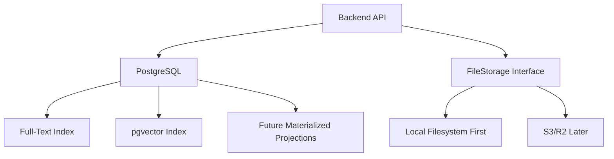
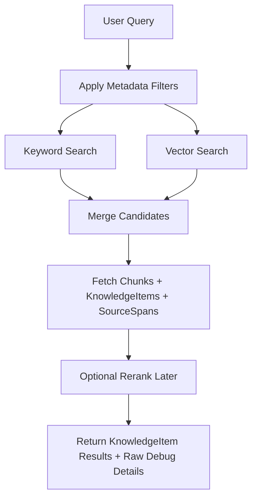

# 05 — Storage and Indexing

## Goal

Now that we have the core data model, we need to decide where things live.

The important objects are:

```text
SourceAsset
Document
SourceSpan
KnowledgeItem
Chunk
ChunkEmbedding
ExtractionRun
```

This document is about storage and indexing, not backend API endpoints yet.

---

## First Principle: Storage Is Not the Same as Indexing

A RAG system usually has both:

```text
source-of-truth storage
```

and

```text
search indexes
```

They are not the same thing.

Source-of-truth storage contains canonical or audit-worthy data:

- uploaded PDFs
- document metadata
- source spans
- knowledge items
- structured data
- confidence scores
- extraction runs
- chunks

Search indexes are derived:

- keyword index
- vector index
- future projection tables

Rule:

> Store canonical knowledge first. Index it second.

---

## First Implementation Stack

We choose:

```text
PostgreSQL
  → relational metadata
  → JSON structured_data/confidence/locators
  → full-text search
  → pgvector embeddings

FileStorage interface
  → LocalFileStorage first
  → S3/R2/Supabase-style object storage later
```

This keeps the first version understandable and hostable without introducing too many services.

---

## High-Level Storage Architecture



---

## Tables

Initial tables:

```text
source_assets
documents
source_spans
knowledge_items
chunks
chunk_embeddings
extraction_runs
```

Future projection tables:

```text
ingredient_mentions
code_symbols
video_segments
paper_citations
```

We will **not** create `ingredient_mentions` immediately.

For the first version, normalized ingredients live in:

```text
knowledge_items.structured_data.ingredients[]
```

and recipe chunks provide searchable ingredient text.

---

## 1. `source_assets`

Stores original uploaded/imported files.

Key fields:

```text
id
source_type
original_filename
storage_provider
storage_key
content_hash
upload_status
created_at
updated_at
```

Example:

```json
{
  "source_type": "pdf",
  "original_filename": "the-food-lab.pdf",
  "storage_provider": "local",
  "storage_key": "source-assets/asset_123/original.pdf",
  "content_hash": "...",
  "upload_status": "uploaded"
}
```

### Upload status

`upload_status` tracks file storage only and is independent of ingestion progress. See [02 — Core Data Model](./02-core-data-model.md#upload_status) for the enum.

### Storage migration

The database stores a provider/key pair, not an absolute local path.

To migrate from local storage to S3/R2 later:

1. copy the file to the new storage provider
2. keep the same logical `storage_key` if possible
3. update `storage_provider`
4. leave `SourceAsset.id` unchanged

This lets the rest of the system keep referencing the same asset.

---

## 2. `documents`

Stores document-level metadata and ingestion status.

For now:

```text
one PDF = one Document
```

Key fields:

```text
id
asset_id
category
subcategory
title
author
source_type
language
active_source_version
status
created_at
updated_at
```

### Document status

`Document.status` is the field the frontend polls after upload. Its enum values, transitions (including failure, `needs_review`, and retry/reprocess), and the meaning of `ready` vs `needs_review` are defined in [02 — Core Data Model](./02-core-data-model.md#status). Storage-side, it is a single `text` column on `documents`.

### Intentional denormalization, nullability

`documents.source_type` is intentionally denormalized from `source_assets.source_type`, and `subcategory` / `language` / `active_source_version` are nullable. See [02 — Core Data Model](./02-core-data-model.md#2-document) for the field-level rules.

---

## 3. `source_spans`

Stores immutable extracted text snapshots and source locations.

Key fields:

```text
id
document_id
source_version
source_type
locator JSON
locator_hash
text
text_hash
created_at
```

PDF convention:

> one source span per PDF page

Example:

```json
{
  "document_id": "doc_123",
  "source_version": 1,
  "source_type": "pdf",
  "locator": {
    "type": "pdf_page_range",
    "page_start": 42,
    "page_end": 42
  },
  "locator_hash": "...",
  "text": "Tomato and White Bean Soup\nServes 4\nIngredients...",
  "text_hash": "..."
}
```

### Span stability, retention, hashes, denormalization

`SourceSpan` immutability, `source_version` semantics and retry rule, retention rules, `locator_hash` / `text_hash`, and the intentional denormalization of `source_type` are all defined in [02 — Core Data Model](./02-core-data-model.md#3-sourcespan).

Storage-side: spans are an append-only table. Updates to `documents.active_source_version` happen only after a new version is accepted, so old `KnowledgeItem.source_span_ids` keep resolving.

---

## 4. `extraction_runs`

Stores LLM extraction attempts.

Key fields:

```text
id
document_id
source_version
provider
model
prompt_version
schema_version
input_source_span_ids
input_hash
status
output_json
error_message
created_at
completed_at
```

Status enum and meanings are defined in [02 — Core Data Model](./02-core-data-model.md#7-extractionrun).

This table answers:

> How did this extracted knowledge get created?

Extraction runs are audit records. After completion, they should be treated as append-only.

---

## 5. `knowledge_items`

Stores meaningful extracted objects.

For the first domain, recipes are stored as:

```text
item_type = "recipe"
```

Key fields:

```text
id
document_id
extraction_run_id
source_version
item_type
title
normalized_title
summary
body_text
source_span_ids
structured_data JSON
confidence JSON
status
created_at
updated_at
```

Item status enum, supersede policy, `normalized_title` semantics, and the `source_version` referential rule are defined in [02 — Core Data Model](./02-core-data-model.md#4-knowledgeitem).

Storage-side, this table holds the canonical extracted knowledge. There is no `rejected` item status; hard-validation failures stay on `extraction_runs`. Older items are marked `superseded` rather than deleted, and a future cleanup job can prune them once nothing references their chunks.

---

## 6. `chunks`

Stores derived retrieval units.

Key fields:

```text
id
document_id
parent_type
parent_id
chunk_type
text
text_hash
source_span_ids
metadata JSON
created_at
updated_at
```

Canonical chunk types, `parent_type` enum, `text_hash` semantics, the superseded-parent filtering policy, and the `chunks.document_id` denormalization are all defined in [02 — Core Data Model](./02-core-data-model.md#5-chunk).

Important:

> Chunks are derived from ready knowledge items and can be regenerated.

---

## 7. `chunk_embeddings`

Stores vector embeddings for chunks.

Key fields:

```text
id
chunk_id
embedding_provider
embedding_model
embedding_dimensions
embedding_vector
created_at
```

### Re-embedding semantics

A chunk can have multiple embeddings, one per provider/model pair.

Unique key:

```text
(chunk_id, embedding_provider, embedding_model)
```

Rules:

- new embedding model → insert new rows
- same provider/model for same chunk → replace/upsert that row
- changed chunk text → create/regenerate the chunk, then embed the new chunk

---

## 8. Future Projection: `ingredient_mentions`

`ingredient_mentions` is a future recipe-specific materialized projection.

It is not the core model.

Canonical ingredient data remains in:

```text
knowledge_items.structured_data.ingredients[]
```

When added, the projection should be rebuilt after recipe `KnowledgeItem` extraction completes.

Suggested fields:

```text
id
knowledge_item_id
position
raw_text
quantity_text
quantity_value
unit_raw
unit_normalized
item_text
item_normalized
preparation
notes
confidence JSON
created_at
```

`position` preserves ingredient order for UI display.

`item_text` is the extracted ingredient phrase for display/audit. `item_normalized` is the canonical/search form used for filtering.

Suggested indexes:

```text
item_normalized
unit_normalized
knowledge_item_id
(item_normalized, knowledge_item_id)
```

This projection will help queries like:

- recipes with chickpeas
- recipes without peanuts
- recipes using pantry ingredients
- recipes with chicken but no dairy

But it is deferred until ingredient filtering becomes part of the MVP search behavior.

---

## Keyword Search

Keyword search handles exact matching.

This matters for:

- ingredient names
- recipe titles
- cookbook titles
- technical terms later
- code identifiers later

Examples:

```text
"gochujang"
"white beans"
"SwiftUI NavigationStack"
```

For the first version, PostgreSQL full-text search is enough.

---

## Vector Search

Vector search handles semantic matching.

Examples:

```text
cozy soup for a cold night
quick weeknight dinner
something acidic and fresh
beginner explanation of embeddings
```

The vector index searches over `chunk_embeddings`.

Vector search complements keyword search. It does not replace it.

---

## Hybrid Search

Eventually retrieval should combine:

```text
keyword results + vector results + structured filters
```

Example query:

> Find vegetarian recipes with chickpeas that feel cozy.

This could use:

- metadata filter: `category = recipes`
- keyword search: `chickpeas`, `vegetarian`
- vector search: `cozy`
- future ingredient projection: `item_normalized = chickpea`

---

## Reranking

Reranking is useful but deferred.

MVP retrieval can return merged keyword/vector results without a reranker.

The architecture should leave room for a later reranking step:

```text
retrieve candidates → optional rerank → return results
```

---

## Retrieval Flow



---

## Canonical vs Derived Data

| Data | Role | Rebuild strategy |
| --- | --- | --- |
| Original PDF | Canonical | Must be preserved or re-uploaded |
| SourceAsset record | Canonical metadata | Preserve |
| Document metadata | Canonical metadata | Preserve/user-editable |
| SourceSpan text | Immutable canonical extraction snapshot | Do not edit; create new `source_version` on re-extraction |
| ExtractionRun | Append-only audit | Preserve |
| KnowledgeItem | Canonical extracted knowledge for active source version | Can be superseded by re-extraction |
| Chunk | Derived retrieval unit | Regenerate from ready KnowledgeItems |
| ChunkEmbedding | Derived vector | Regenerate from chunks/model |
| Keyword index | Derived index | Rebuild |
| Ingredient projection | Future derived projection | Rebuild from `structured_data.ingredients[]` |

---

## Uniqueness Constraints Worth Stating Early

Suggested constraints:

```text
source_assets.content_hash unique

documents.asset_id unique
  -- because one PDF = one Document for now

source_spans(document_id, source_version, locator_hash) unique

chunk_embeddings(chunk_id, embedding_provider, embedding_model) unique
```

Useful but potentially softer constraints:

```text
knowledge_items(document_id, item_type, normalized_title, source_version)
chunks(parent_type, parent_id, chunk_type, text_hash)
```

The softer ones may be enforced in application logic first because extraction/deduplication will evolve.

---

## Timestamps and Mutability

Mutable/current-state tables:

```text
source_assets       created_at + updated_at
documents           created_at + updated_at
knowledge_items     created_at + updated_at
chunks              created_at + updated_at
```

Immutable/append-only or derived tables:

```text
source_spans        created_at only; immutable
extraction_runs     created_at + completed_at; append-only after completion
chunk_embeddings    created_at; replaceable per provider/model
future projections  created_at; rebuildable
```

---

## Async Ingestion

Ingestion is asynchronous from the API client's perspective: an upload creates `SourceAsset + Document(status=queued)` synchronously, then the backend runs the ingestion job in the background. The async model, MVP-vs-future implementation, mid-pipeline retry behavior, and stuck-job recovery rule are defined in [03 — PDF Ingestion Pipeline](./03-pdf-ingestion-pipeline.md#sync-vs-async-ingestion).

Storage-side, this means `documents.status` is the durable progress signal, derived rows from failed attempts may need cleanup, and a future durable job queue will live alongside (not replace) the tables in this document.

---

## First Storage Version

For the first build:

```text
Store PDFs through FileStorage interface
Use LocalFileStorage first
Store metadata/extracted data in PostgreSQL
Store structured data as JSON
Store normalized ingredients inside recipe structured_data first
Store chunks in PostgreSQL
Store embeddings in pgvector
Use PostgreSQL full-text search first
Return generic search results plus raw retrieval details
```

This is enough to build:

- upload one PDF
- extract per-page source spans
- extract recipe KnowledgeItems with an LLM
- normalize ingredients
- create canonical recipe chunks
- search by text and basic ingredient text
- return `KnowledgeItem` search results with citations
- expose raw retrieval details for debugging

---

## Resolved Storage Choices

1. Use **PostgreSQL + pgvector** as the main storage/search foundation.
2. Use a **file storage interface** from the beginning.
3. First file storage implementation is local filesystem.
4. Do not create `ingredient_mentions` immediately.
5. Search API responses should return both generic `KnowledgeItem` results and raw retrieval details.
6. Reranking is deferred, but the retrieval flow leaves room for it.

---

## Next Step

The next document defines the backend API shape:

> What endpoints does the backend expose for upload, ingestion status, search results, and raw retrieval debugging?

See [06 — Backend API Shape](./06-backend-api-shape.md).
