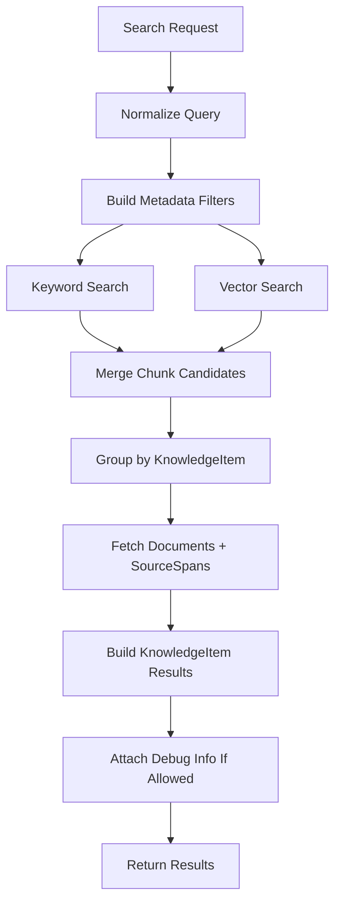

# 07 — Retrieval Behavior

## Goal

This document explains what happens inside:

```text
POST /api/v1/search
```

The goal is to turn a user query into useful `KnowledgeItem` search results with citations.

For the MVP, retrieval is recipe-focused, but the design should still fit the larger knowledge-library direction.

---

## First Principle: Retrieval Is Not the Same as Answer Generation

Retrieval means:

```text
Find the best source material for the query.
```

Answer generation means:

```text
Use retrieved material to write a natural-language answer.
```

For the first recipe MVP, we should get retrieval working before building a query-time LLM answer layer.

So the first search response should return:

- generic `KnowledgeItem` results
- small display projections for list UIs
- optional structured previews for known item types
- matched chunks
- citations
- optional raw debug details

Later, the answer layer can summarize or compare retrieved recipes.

---

## MVP Retrieval Summary

The first version uses hybrid retrieval:

```text
metadata filters
+ keyword search
+ vector search
+ merge scoring
+ `KnowledgeItem` result aggregation
```

No ML reranker in the MVP.

Reranking remains optional later, as described in [05 — Storage and Indexing](./05-storage-and-indexing.md#reranking).

---

## Search Flow



---

## 1. Search Request

The API request shape is defined in [06 — Backend API Shape](./06-backend-api-shape.md#7-search).

Example:

```json
{
  "query": "cozy soup with white beans",
  "category": "recipes",
  "subcategory": null,
  "filters": {
    "item_type": "recipe",
    "document_ids": [],
    "exclude_needs_review": true
  },
  "limit": 10,
  "include_debug": true,
  "mode": "hybrid"
}
```

For the MVP:

- `query` is required
- `category` defaults to `recipes`
- `item_type` defaults to `recipe`
- `limit` defaults to `10`
- `include_debug` is honored only in development/local mode for the MVP
- `mode` defaults to `hybrid`

---

## 2. Query Normalization

Before searching, normalize the query.

Example input:

```text
"  Cozy soup with WHITE beans!! "
```

Normalized form:

```text
"cozy soup with white beans"
```

Basic normalization:

- trim whitespace
- collapse repeated spaces
- lowercase for keyword processing
- preserve original query for display

Important:

> Query normalization should not destroy meaning.

For example, later programming searches may care about exact casing in code symbols. For recipes, simple normalization is fine.

---

## 3. Metadata Filters

Metadata filters narrow the searchable universe before ranking.

This is where categories matter.

### MVP default filters

User-facing search should only search chunks whose parent knowledge item is ready and not superseded:

```text
knowledge_items.status = ready
knowledge_items.source_version = documents.active_source_version
chunks.parent_type = knowledge_item
```

Also apply request filters:

```text
documents.category = request.category
knowledge_items.item_type = request.filters.item_type
```

For recipe MVP, that usually means:

```text
category = recipes
item_type = recipe
```

### `subcategory` behavior

`subcategory = null` on a document means:

```text
top-level category only; no narrower subcategory assigned
```

For search requests:

- if `subcategory` is omitted, search all subcategories inside the category
- if `subcategory` is provided, filter to that exact subcategory for MVP
- later, we may support subcategory prefix matching such as `programming/ios/*`

---

## 4. Keyword Search

Keyword search handles exact or near-exact text matching.

It is useful for:

- recipe titles
- ingredients
- cookbook titles
- specific food terms
- later technical terms and code symbols

Examples:

```text
white beans
gochujang
chicken thighs
```

For the first implementation, use PostgreSQL full-text search over `chunks.text` and chunk metadata.

Keyword search should return chunk candidates like:

```json
{
  "chunk_id": "chunk_123",
  "knowledge_item_id": "item_123",
  "chunk_type": "recipe_ingredients",
  "retrieval_source": "keyword",
  "rank": 1,
  "raw_score": 8.42
}
```

---

## 5. Vector Search

Vector search handles semantic meaning.

It is useful for searches like:

```text
cozy soup for a cold night
quick weeknight dinner
something bright and acidic
comforting vegetarian meal
```

The backend embeds the query with the same embedding provider/model used for searchable chunks.

Then it searches `chunk_embeddings` with pgvector.

Vector search should return chunk candidates like:

```json
{
  "chunk_id": "chunk_456",
  "knowledge_item_id": "item_123",
  "chunk_type": "recipe_summary",
  "retrieval_source": "vector",
  "rank": 3,
  "distance": 0.18,
  "similarity": 0.82
}
```

### Embedding model rule

Only compare vectors created by the same embedding model.

So vector search must filter by:

```text
embedding_provider
embedding_model
```

This follows the `ChunkEmbedding` rule in [02 — Core Data Model](./02-core-data-model.md#6-chunkembedding).

---

## 6. Candidate Counts

The search endpoint should retrieve more candidates than it returns.

Initial MVP constants:

```text
final_limit = request.limit or 10
keyword_top_k = max(final_limit * 5, 50)
vector_top_k = max(final_limit * 5, 50)
```

Why over-fetch?

Because keyword and vector search may find different useful candidates. We need enough candidates to merge before selecting the final top results.

These are tuning constants, not permanent rules.

---

## 7. Chunk Type Behavior

Recipe chunks have one canonical set of chunk types:

```text
recipe_full
recipe_title
recipe_summary
recipe_ingredients
recipe_steps
```

Each chunk type helps a different kind of query.

| Chunk type | Useful for |
| --- | --- |
| `recipe_title` | exact title lookup |
| `recipe_ingredients` | ingredient and pantry queries |
| `recipe_steps` | cooking techniques and methods |
| `recipe_summary` | semantic/vibe queries |
| `recipe_full` | broad fallback retrieval |

### Starting chunk-type boosts

Keyword and vector search should not weight chunk types exactly the same.

Initial keyword boosts:

| Chunk type | Keyword boost |
| --- | ---: |
| `recipe_title` | 1.40 |
| `recipe_ingredients` | 1.20 |
| `recipe_steps` | 1.05 |
| `recipe_summary` | 1.00 |
| `recipe_full` | 0.95 |

Initial vector boosts:

| Chunk type | Vector boost |
| --- | ---: |
| `recipe_summary` | 1.20 |
| `recipe_full` | 1.10 |
| `recipe_steps` | 1.00 |
| `recipe_ingredients` | 0.95 |
| `recipe_title` | 0.90 |

Why different boosts?

Keyword search is good at exact ingredient/title matching.

Vector search is good at semantic intent, so summaries and full recipe text are often more useful there.

These numbers are starting guesses. We should expect to tune them after testing real cookbook searches.

---

## 8. Merging Keyword and Vector Results

Keyword and vector scores are not naturally comparable.

A keyword score of `8.42` and a vector similarity of `0.82` do not mean the same thing.

So for the MVP, use rank-based merging.

Recommended method:

```text
weighted reciprocal rank fusion
```

Simplified formula:

```text
candidate_score = source_weight * chunk_type_boost * (1 / (rrf_k + rank))
```

Initial constants:

```text
rrf_k = 60
keyword_source_weight = 1.0
vector_source_weight = 1.0
```

If the same chunk appears in both keyword and vector results, add the scores together.

This is simple, robust, and easier to reason about than trying to directly compare raw keyword and vector scores.

---

## 9. Grouping by KnowledgeItem

Search retrieves chunks, but the frontend wants item-level results.

So after merging chunk candidates, group them by parent `KnowledgeItem`.

Example:

```text
chunk_1 recipe_ingredients → item_123
chunk_2 recipe_summary     → item_123
chunk_3 recipe_steps       → item_456
```

Then calculate an item-level score.

Initial item score:

```text
item_score = best_chunk_score + supporting_chunk_bonus
```

Where:

```text
best_chunk_score = max(candidate_score for chunks belonging to item)
supporting_chunk_bonus = small bonus for additional matched chunk types
```

Initial bonus:

```text
0.05 per additional matched chunk type, capped at 0.15
```

Why group by item?

Because a recipe may match in multiple ways:

- title match
- ingredient match
- semantic summary match
- technique match

The search result should be one `KnowledgeItem` result, not five separate chunks for the same recipe.

---

## 10. Fetching Source Data

After the final items are selected, fetch:

- `KnowledgeItem`
- parent `Document`
- matched `Chunk`s
- referenced `SourceSpan`s

Only fetch the source spans needed for citations and snippets.

For PDFs, source span locators become page labels like:

```text
page 42
pages 42–43
```

The UI should display citations clearly so the user can trace a result back to the cookbook.

---

## 11. Search Result Construction

A search result is a generic API envelope, not a concrete object per domain type.

This is important because we do not want to create a required concrete API result object for every future domain type.

Instead, search returns a generic `KnowledgeItemResult` built from:

```text
KnowledgeItem
+ optional structured_preview derived from structured_data
+ Document metadata
+ matched Chunks
+ SourceSpan locators
```

`KnowledgeItem.structured_data` remains the canonical type-specific source of truth.

`structured_preview` is only a small derived preview for search-result UIs. It should never replace the full `structured_data` returned by:

```text
GET /api/v1/knowledge-items/{item_id}
```

Example shape:

```json
{
  "type": "knowledge_item_result",
  "item": {
    "id": "item_123",
    "item_type": "recipe",
    "schema": "recipe.v1",
    "title": "Tomato and White Bean Soup",
    "summary": "A simple soup with pantry ingredients.",
    "status": "ready",
    "confidence": {
      "overall": 0.88
    }
  },
  "display": {
    "title": "Tomato and White Bean Soup",
    "subtitle": "Simple Thai Food · page 42",
    "snippet": "White beans, tomato, olive oil...",
    "badges": ["Serves 4", "35 minutes"]
  },
  "structured_preview": {
    "schema": "recipe.preview.v1",
    "yield": "Serves 4",
    "top_ingredients": ["white beans", "tomato", "olive oil"]
  },
  "document": {
    "id": "doc_123",
    "title": "Simple Thai Food",
    "author": "Leela Punyaratabandhu"
  },
  "matched_chunks": [
    {
      "chunk_id": "chunk_123",
      "chunk_type": "recipe_ingredients",
      "score": 0.82
    }
  ],
  "source_citations": [
    {
      "source_span_id": "span_042",
      "label": "page 42"
    }
  ]
}
```

The result envelope should be enough for a search results page, while the detail endpoint provides the full canonical object.

---

## 12. Debug Information

When debug output is allowed, include enough information to understand why a result appeared.

Example:

```json
{
  "debug": {
    "retrieval_mode": "hybrid",
    "embedding_model": "text-embedding-example",
    "filters_applied": {
      "category": "recipes",
      "item_type": "recipe",
      "status": "ready"
    },
    "keyword_top_k": 50,
    "vector_top_k": 50,
    "keyword_candidates": [],
    "vector_candidates": [],
    "merged_candidates": [],
    "chunk_type_boosts": {},
    "rerank_applied": false
  }
}
```

Debug data is especially useful while learning because retrieval problems are often invisible otherwise.

Common questions debug output should help answer:

- Did keyword search find anything?
- Did vector search find different candidates?
- Which chunk type matched?
- Was the result filtered out because the item was `needs_review` or `superseded`?
- Which source spans created the citation?

---

## 13. Retrieval Modes

The API should support explicit retrieval modes for the MVP.

Initial enum:

```text
hybrid
keyword
vector
```

Default:

```text
hybrid
```

This is a resolved MVP choice: normal users get `hybrid` by default, while `keyword` and `vector` are available for learning and debugging retrieval behavior.

Why support `keyword` and `vector` modes?

They are useful for debugging.

Example:

- keyword mode helps test exact ingredient/title search
- vector mode helps test semantic behavior
- hybrid mode is what users should normally use

If the client does not send a mode, use `hybrid`.

---

## 14. What We Are Not Doing Yet

For the MVP, we are not yet adding:

- ML reranking
- query-time LLM answer generation
- auto query routing across categories
- ingredient projection table filtering
- pantry matching
- dietary restriction parsing
- graph search
- query expansion
- HyDE-style synthetic query generation

These may all be useful later.

But first we want a retrieval system we can inspect and understand.

---

## 15. Example End-to-End Search

Query:

```text
cozy soup with white beans
```

Flow:

```text
1. Normalize query.
2. Filter to category=recipes and item_type=recipe.
3. Keyword search finds chunks mentioning "white beans".
4. Vector search finds semantically cozy soup recipes.
5. Merge keyword and vector candidates with rank fusion.
6. Group chunks by recipe KnowledgeItem.
7. Fetch document and source spans.
8. Return `KnowledgeItem` results with citations.
```

The best result may come from both sides:

- `recipe_ingredients` matched `white beans`
- `recipe_summary` matched `cozy soup`

That is exactly why hybrid retrieval is useful.

---

## What This Teaches

This step teaches that retrieval quality is a system design problem, not just an embedding problem.

Good retrieval depends on:

- useful chunks
- clean metadata filters
- keyword search for exact terms
- vector search for semantic intent
- careful result merging
- grouping chunks into product-level results
- citations back to source spans
- debug visibility

---

## Resolved Retrieval Choices

For the MVP:

1. Support explicit retrieval modes: `hybrid`, `keyword`, and `vector`.
2. Default retrieval mode is `hybrid`.
3. Accept the proposed chunk-type boosts as starting tuning constants.
4. Default search category is `recipes`.
5. Search debug output is available only in development/local mode.

## Next Step

The next architecture document covers the query-time answer layer:

> After retrieval finds results, when should an LLM generate an answer, and how do we keep it grounded in citations?

See [08 — Query-Time Answer Layer](./08-query-time-answer-layer.md).
