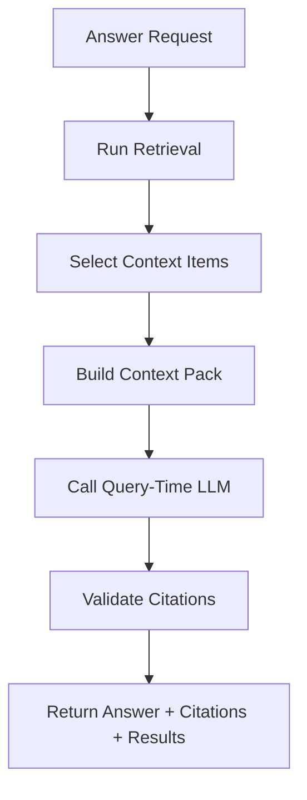

# 08 — Query-Time Answer Layer

## Goal

This document explains when and how the system should use an LLM at query time.

The previous document, [07 — Retrieval Behavior](./07-retrieval-behavior.md), focused on finding relevant `KnowledgeItem` results.

This document focuses on what happens after retrieval:

```text
User question
  → retrieve relevant KnowledgeItems and chunks
  → optionally ask an LLM to synthesize an answer
  → return answer with citations
```

---

## First Principle: Answers Are Derived, Not Canonical

The answer layer should not become the source of truth.

Canonical knowledge lives in:

```text
KnowledgeItem.structured_data
SourceSpan
Document metadata
```

Search results are derived from chunks and embeddings.

LLM answers are another derived layer.

That means:

> If an answer disagrees with the retrieved source material, the source material wins.

The answer layer should make retrieved knowledge easier to understand, compare, and use. It should not invent new knowledge and store it as fact.

---

## Why Not Make Every Search an LLM Answer?

A common RAG demo pattern is:

```text
user asks question → retrieve chunks → LLM writes answer
```

That is useful, but it should not be the only interaction mode.

For this project, many user actions are better as search/browse first:

- "white beans"
- "gochujang"
- "quick chicken dinner"
- "show me soups"
- "find recipes from this cookbook"

Those queries should return inspectable results directly.

The LLM answer layer is most useful when the user wants synthesis:

- "Which of these recipes is quickest?"
- "What are good cozy soups with beans?"
- "Compare these three recipes."
- "What can I make with white beans and tomatoes?"
- "Summarize the differences between these results."

So the architecture should keep retrieval and answer generation separate.

---

## MVP Decision

The query-time answer layer is part of the MVP, but it should be implemented after basic retrieval works.

Build order:

```text
retrieval first → answer generation second
```

The API shape is intentionally deferred for now.

Two viable options remain:

```text
POST /api/v1/search    → retrieval only
POST /api/v1/answers   → retrieval + answer generation
```

or:

```text
POST /api/v1/search { "include_answer": true }
```

The first option keeps retrieval and generation more separate. The second option is simpler for clients. We can decide once the search endpoint exists.

---

## Answer Flow



---

## 1. Answer Request

A possible answer request looks like this:

```json
{
  "query": "What are good cozy soups with white beans?",
  "category": "recipes",
  "filters": {
    "item_type": "recipe"
  },
  "retrieval": {
    "mode": "hybrid",
    "limit": 8
  },
  "answer": {
    "style": "recommendation",
    "include_results": true
  }
}
```

The request contains two ideas:

1. Retrieval settings: how to find relevant items.
2. Answer settings: how to synthesize the retrieved items.

For the first answer version, retrieval should reuse the behavior from [07 — Retrieval Behavior](./07-retrieval-behavior.md).

---

## 2. Run Retrieval First

The answer layer should never skip retrieval.

It should first produce `KnowledgeItemResult`s using the same retrieval logic as `POST /api/v1/search`.

That means it inherits:

- metadata filters
- `status = ready`
- active source version filtering
- keyword search
- vector search
- chunk-type boosts
- rank fusion
- citations

This keeps answer generation grounded in the same inspectable retrieval system.

---

## 3. Select Context Items

The answer LLM should not receive every search result.

It should receive a smaller context set.

Initial MVP constants:

```text
answer_context_item_limit = min(search_limit, 6)
matched_chunks_per_item = 3
```

Why limit context?

- reduces cost
- reduces latency
- reduces irrelevant information
- makes citation validation easier

These constants are starting points and should be tuned after testing.

---

## 4. Build a Context Pack

The context pack is what we give the LLM.

It should be structured and citation-friendly.

Example conceptual shape:

```json
{
  "query": "What are good cozy soups with white beans?",
  "items": [
    {
      "context_item_id": "ctx_1",
      "knowledge_item_id": "item_123",
      "item_type": "recipe",
      "title": "Tomato and White Bean Soup",
      "summary": "A simple soup with pantry ingredients.",
      "document": {
        "title": "Simple Thai Food",
        "author": "Leela Punyaratabandhu"
      },
      "structured_preview": {
        "schema": "recipe.preview.v1",
        "yield": "Serves 4",
        "top_ingredients": ["white beans", "tomato", "olive oil"]
      },
      "matched_chunks": [
        {
          "chunk_id": "chunk_123",
          "chunk_type": "recipe_ingredients",
          "text": "2 tbsp olive oil\n1 onion\n2 cans white beans...",
          "citation_id": "cite_1"
        }
      ],
      "citations": [
        {
          "citation_id": "cite_1",
          "source_span_id": "span_042",
          "label": "Simple Thai Food, page 42"
        }
      ]
    }
  ]
}
```

The LLM should cite `citation_id`s from the context pack.

---

## Context Pack Rules

The context pack should include enough information to answer, but not the entire cookbook.

For recipes, include:

- title
- summary
- yield/time fields when available
- relevant ingredient text
- relevant matched chunks
- source citation IDs

Avoid including by default:

- entire cookbook pages
- every recipe step for every result
- unrelated surrounding source text

For authenticated personal use, the answer layer may include full recipe instructions when the request explicitly needs them. Even then, it should use the canonical `KnowledgeItem.structured_data`, cite the source, and avoid exposing that output publicly.

---

## 5. Query-Time LLM Prompt Rules

The answer LLM should follow strict grounding rules.

Suggested rules:

```text
Use only the provided context for source-backed claims.
Do not invent recipes, ingredients, times, or cookbook sources.
If the context is insufficient, say so.
Cite every recommended item using provided citation IDs.
Do not cite sources that were not provided.
Prefer concise answers.
Only reproduce full recipe instructions in authenticated personal contexts when requested or clearly needed.
```

The model can explain and compare retrieved items, but it should not create new canonical data.

---

## 6. Answer Response Shape

A query-time answer should be structured, not just free text.

Example response:

```json
{
  "query": "What are good cozy soups with white beans?",
  "answer": {
    "style": "recommendation",
    "text": "A strong match is Tomato and White Bean Soup because it directly uses white beans and has a simple soup structure. Another good option is Tuscan Bean Stew if you want something heartier.",
    "citations": ["cite_1", "cite_2"]
  },
  "recommendations": [
    {
      "knowledge_item_id": "item_123",
      "title": "Tomato and White Bean Soup",
      "reason": "Uses white beans directly and matches the soup request.",
      "citation_ids": ["cite_1"]
    }
  ],
  "citations": [
    {
      "citation_id": "cite_1",
      "knowledge_item_id": "item_123",
      "source_span_id": "span_042",
      "label": "Simple Thai Food, page 42"
    }
  ],
  "results": [],
  "warnings": []
}
```

The `results` field can optionally include the underlying `KnowledgeItemResult`s from retrieval.

---

## 7. Citation Validation

The backend should validate the answer before returning it.

Validation rules:

- every `citation_id` in the answer must exist in the context pack
- every recommendation must have at least one citation
- every cited `knowledge_item_id` must come from retrieved results
- if citations are invalid, retry or return a safe fallback

Safe fallback example:

```text
I found relevant results, but could not generate a citation-safe answer. Here are the retrieved items instead.
```

This is important because LLMs can hallucinate citation IDs.

---

## 8. Copyright and Privacy Guardrails

This is a personal library, but we should still design carefully.

For the MVP answer layer:

- do not expose source text publicly
- do not return full cookbook pages in public/shared responses
- allow full recipe instructions for authenticated personal use
- cite the source when full instructions are shown
- keep hosted API protected by the personal API token described in [06 — Backend API Shape](./06-backend-api-shape.md#authentication-note)

The app can help the user inspect their own stored knowledge, including full recipes, but answer generation should not turn private copyrighted source text into publicly exposed output.

---

## 9. Answer Styles

The answer endpoint can support a small enum of answer styles.

Initial options:

```text
summary
recommendation
comparison
direct_answer
```

### `summary`

Summarize the retrieved results.

### `recommendation`

Recommend one or more items and explain why.

### `comparison`

Compare multiple retrieved items.

### `direct_answer`

Answer a specific question using retrieved context.

For the recipe MVP, implement `recommendation` first.

`comparison`, `summary`, and `direct_answer` can follow after the first recommendation flow works.

---

## 10. What the Answer Layer Should Not Do Yet

Not in the first answer version:

- autonomous agents
- multi-step meal planning
- shopping list generation
- nutritional analysis
- dietary restriction inference
- recipe modification/substitution as a source-backed claim
- cross-category query routing
- persistent chat memory

These can come later.

The first answer layer should be:

```text
retrieval-grounded synthesis with citations
```

---

## 11. Debug Information

Answer debug output should be development/local only, like search debug output.

Useful debug fields:

```json
{
  "debug": {
    "retrieval_mode": "hybrid",
    "model": "example-query-model",
    "prompt_version": "answer-v1",
    "context_item_count": 6,
    "citation_count": 8,
    "retrieval_debug": {}
  }
}
```

This helps answer questions like:

- what context did the LLM see?
- which model generated the answer?
- which citations were available?
- did citation validation pass?

---

## What This Teaches

This step teaches that RAG answer quality depends on more than prompting.

Good query-time answers require:

- good retrieval
- clear context packing
- strict prompt rules
- structured output
- citation validation
- safe fallbacks
- frontend-visible source citations

The LLM should be the final synthesis layer, not the only intelligence in the system.

---

## Resolved Answer-Layer Choices

For the MVP:

1. Include the query-time answer layer in the MVP, but implement it after retrieval works.
2. Defer the exact API shape decision: separate `/answers` endpoint vs `search.include_answer`.
3. Allow full recipe instructions for authenticated personal use.
4. Implement `recommendation` as the first answer style.
5. Keep answer debug output development/local only.

## Next Step

The next architecture document should cover frontend architecture:

> What screens and client responsibilities do the web/iOS frontends have, and what should remain backend-owned?
